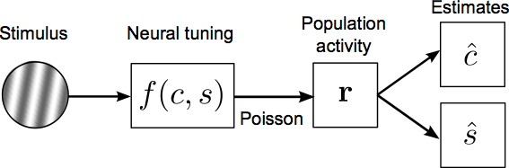

# neurosci-fisher-information
Example Matlab code illustrating a neural computational model of human sensory discrimination behavior

## About
The repository contains Matlab functions for fitting human sensory discrimination thresholds i.e., the performance of a human observer at discriminating two different luminance contrasts or two different stimulus orientations. The model essentially combines an early **encoding** or **sensor** stage (i.e., neurons involved in visual processing in the brain) with a later **decoding** or **readout** stage (formally defined as the bound on estimation performance, in an information-theoretic sense). Details of the experiments and model derivation can be found in Chapters 2 and 3 of my [PhD thesis](https://sj971.github.io/docs/thesis_sjackson.pdf). 

Note that the optimization routine described in the code was originally run on a High-Performance Computing cluster at NYU, and utilizes a cutting-edge stochastic optimization method known as [Covariance Matrix Adaptation](https://www.lri.fr/~hansen/cmaesintro.html).
