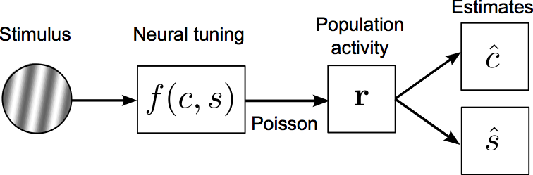

# neurosci-fisher-information
Example Matlab code illustrating a neural computational model of human sensory discrimination behavior

## About
The repository contains Matlab functions for fitting human sensory discrimination thresholds e.g., threshold performance at discriminating two different luminance contrasts, or distinguishing between two different stimulus orientations. The model essentially combines early **encoding** or **sensor** components (i.e., neurons involved in visual processing in the brain) with a later **decoding** or **readout** stage (formally defined as the bound on estimation performance in an information theoretic sense). 

Details of the experiments and model derivation can be found in Chapters 2 and 3 of my [PhD thesis](https://sj971.github.io/docs/thesis_sjackson.pdf). 

Note that the optimization routine here was originally run on a High-Performance Computing cluster at NYU, and utilizes a cutting-edge stochastic optimization method known as [Covariance Matrix Adaptation](https://www.lri.fr/~hansen/cmaesintro.html).

